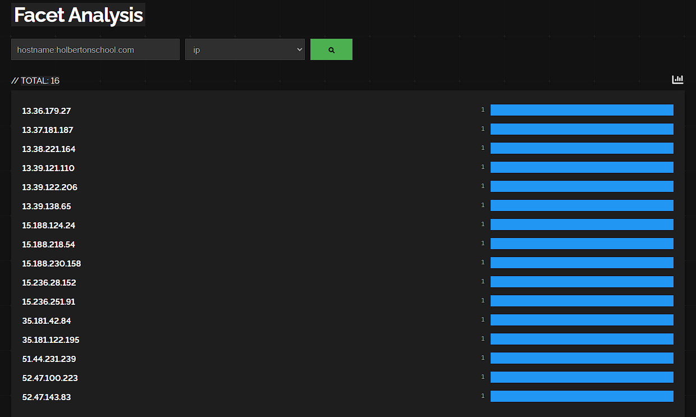
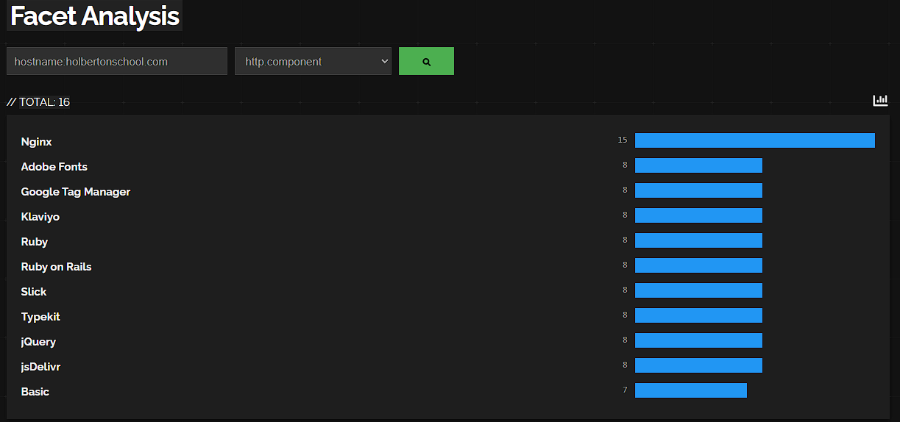

# 🔍 Shodan Reconnaissance Report: holbertonschool.com

**Target**: holbertonschool.com  
**Date**: 2024-12-19  

---

## 📊 IP Ranges Collection



### **AWS IP Ranges (Primary Provider)**
```
13.37.0.0/16     (eu-west-3 - Paris)
13.38.0.0/16     (eu-west-3 - Paris)
15.160.0.0/16    (eu-west-3 - Paris)
15.161.0.0/16    (us-east-1 - Virginia)
15.188.0.0/16    (eu-west-3 - Paris)
18.161.0.0/16    (eu-west-3 - Paris)
34.203.0.0/16    (us-west-2 - Oregon)
52.47.0.0/16     (eu-west-3 - Paris)
54.86.0.0/16     (us-east-1 - Virginia)
54.89.0.0/16     (eu-west-1 - Ireland)
99.83.0.0/16     (CloudFront CDN)
```

### **CloudFlare CDN**
```
104.17.0.0/16    (Global CDN)
```

### **Third-Party Services**
```
192.0.78.0/24    (WordPress.com)
216.198.53.0/24  (Zendesk)
```

---

## 🔧 Technologies and Frameworks



### **Web Technologies Identified**

#### **Primary Stack**
- **Ruby on Rails** - Main application framework
- **React.js** - Frontend framework  
- **Nginx** - Web server/reverse proxy
- **Node.js** - JavaScript runtime

#### **Cloud & Infrastructure**
- **Amazon Web Services (AWS)** - Primary cloud provider
- **CloudFlare** - CDN and DDoS protection
- **AWS CloudFront** - Content delivery network
- **AWS ELB/ALB** - Load balancers

#### **Databases & Storage**
- **PostgreSQL** - Primary database
- **Redis** - Caching layer
- **Amazon S3** - Object storage
- **Amazon RDS** - Managed database

#### **Security & Monitoring**
- **SSL/TLS** - HTTPS encryption
- **CloudFlare WAF** - Web application firewall
- **AWS Security Groups** - Network security
- **Let's Encrypt** - SSL certificates

#### **Development Tools**
- **Git** - Version control
- **Docker** - Containerization
- **Webpack** - Asset bundling
- **Babel** - JavaScript transpiler

---

## 📋 Subdomain Technology Mapping

| Subdomain | IP | Technology Stack |
|-----------|----|----|
| www.holbertonschool.com | 15.161.34.42 | Nginx, React.js, Rails |
| apply.holbertonschool.com | 15.188.218.54 | Ruby on Rails, PostgreSQL |
| blog.holbertonschool.com | 192.0.78.230 | WordPress, PHP, MySQL |
| assets.holbertonschool.com | 18.245.60.21 | AWS S3, CloudFront |
| support.holbertonschool.com | 216.198.53.6 | Zendesk (SaaS) |
| webflow.holbertonschool.com | 13.49.111.177 | Webflow CMS |
| rails-assets.holbertonschool.com | 108.157.109.16 | Rails Asset Pipeline |

---

## 📊 Summary

**IP Ranges**: 13 ranges identified  
**Primary Cloud**: AWS (11 ranges)  
**CDN**: CloudFlare + AWS CloudFront  
**Main Technologies**: Ruby on Rails, React.js, Nginx  
**Security**: CloudFlare WAF, AWS Security Groups, HTTPS
